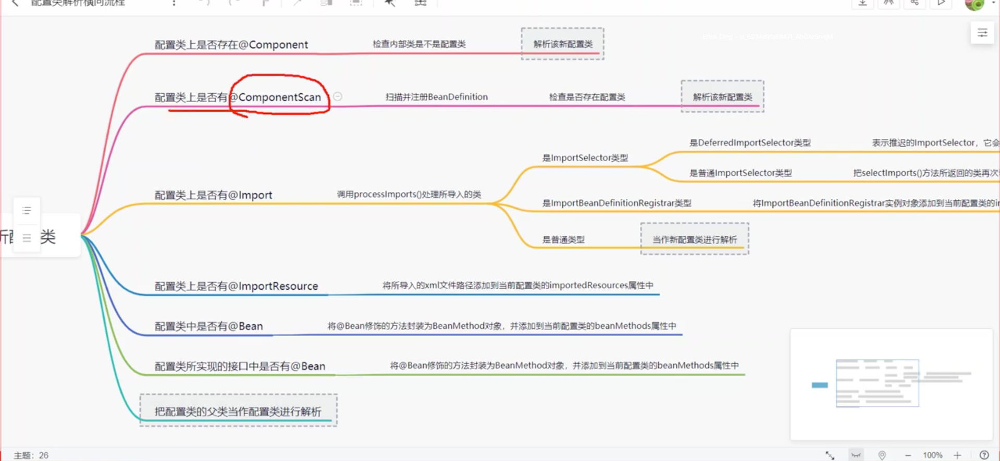

# Spring源码解读

## 1.注解相关
`包扫描阶段`
- 1.Conditional 加载完classe文件，includerFilter过滤之后，判断是否标注了该注解，如有，则跳过该类的bd加载
- 2.Lookup filter校验通过后，会判断是不是抽象类或者接口，如是，则不加载其对应的bd，有一种特殊情况，如果是抽象的且是被Lookup注释的，则要加载其对应的bd
- 3.Lazy Primary 设置bd属性阶段

`初始化阶段`
- 4.DependsOn 创建bean，获取完合并的bd对象RootBeanDefinition之后，查看是否有DependsOn，如有，则先创建依赖的bean

- 1.项目启动类 `AnnotationConfigApplicationContext`

## 2.包扫描相关

入口 ClassPathBeanDefinitionScanner doScan()方法

- 1.扫描指定包下的class文件（加载符合条件的class文件），解析成BeanDefinition对象
  - 1.根据TypeFilter过滤，`excludeFilters` `includeFilters`
  - 2.查看是否被注解`@Conditional`注释，如果是也不注册该bd
  - 3.查看是否是抽象类或者接口，若是，则不注册bd；特殊情况如果是抽象类，但是被`@Lookup`注解修饰则注册该bd
- 2.初始化BeanDefinition的相关属性，设置 Lazy initMethodName destroyMethodName 等属性
- 3.根据注解值设置属性 Primary DependsOn Role Description等属性
- 4.检验是否已经加载过该BeanDefinition对象，重复加载会报错
- 5.将校验通过的BeanDefinition对象注入到`beanDefinitionMap`中，方法返回`BeanDefinitionHolder`对象

## 3.初始化非懒加载的单例Bean

入口 DefaultListableBeanFactory preInstantiateSingletons()

- 1.循环beanName，获取合并后的bd对象（每个bean都对应bd对象，在使用时会生成一个新的bd对象---`RootBeanDefinition`，并把合并后的bd集合Map中--->`mergedBeanDefinitions`）
- 2.如果是单例bean、非懒加载、非抽象bd，则开始创建对象
- 3.是factoryBean走特殊逻辑，非factoryBean直接创建bean，`getBean(beanName)`方法
- 4.所有非懒加载的单例bean全部加载完成后，会执行所有实现了`SmartInitializingSingleton`接口的bean的`afterSingletonsInstantiated()`方法

## 4.getBean 创建bean实例

入口 AbstractBeanFactory getBean()

- 1.推断构造方法，getBean的三个重载方法
- 2.通过name获取beanName
- 3.如果是单例bean，直接从单例池中获取，返回
- 4.else找出所有父类，获取`@DependsOn`注解，先创建依赖的类
- 5.根据scope创建bean
  - 1.单例，直接从单例池中获取，没有则创建，放入单例池
  - 2.元型bean，每次创建新的bean
  - 3.其他类型的bean，根据scope，执行不同的逻辑，比如`@Requestscope` session request会将生成的bean放入其对应的作用域

## 5.createBean 实例化、初始化相关
入口 AbstractAutowireCapableBeanFactory createBean()

- 1.实例化前`InstantiationAwareBeanPostProcessor.postProcessBeforeInstantiation()`，参数为Clss对象，可以修改class对象，如果有返回值，会执行BeanPostProcessor的postProcessAfterInitialization方法，然后直接返回改对象
- 2.实例化
- 3.`MergedBeanDefinitionPostProcessor.postProcessMergedBeanDefinition()`，参数为beanDefinition，可以修改beanDefinition信息
- 4.`InstantiationAwareBeanPostProcessor.postProcessAfterInstantiation()`参数为bean对象；实例化对象之后，属性赋值之前；是给bean实例上执行自定义字段注入
- 5.属性赋值(spring自带的依赖注入)
- 6.`InstantiationAwareBeanPostProcessor.postProcessProperties()`，AutowiredAnnotationBeanPostProcessor实现类，注入注解@AutoWired @Value 标注的属性
  - 1.`AutowiredAnnotationBeanPostProcessor postProcessMergedBeanDefinition()`会生成注入点 `InjectionMetadata`对象
  - 2.`AutowiredAnnotationBeanPostProcessor postProcessProperties()`会执行`inject()`方法，调用反射给自动注入的属性或者方法进行赋值（`AutowiredFieldElement AutowiredMethodElement`）
- 7.执行aware回调 `BeanNameAware BeanClassLoaderAware BeanFactoryAware`
- 8.初始化前 @PostConstruct也是通过BeanPostProcessor的postProcessBeforeInitialization()方法实现的
- 9.初始化 执行`InitializingBean.afterPropertiesSet()`方法;然后再执行`initMethodName()`
- 10.初始化后 `BeanPostProcessor.postProcessAfterInitialization()`
- 11.bean的销毁 实现接口`DisposableBean` 或者方法添加注解 `@PreDestory`
  - 什么时候执行，容器销毁的时候执行  `context.close()`或者`context.reggisterShutdownHook()`
  - 入口 `AbstractApplicationContext doClose()`

## 6. @AutoWired注解详解
入口：`AutowiredAnnotationBeanPostProcessor AutowiredMethodElement AutowiredFieldElement`
`CommonAnnotationBeanPostProcessor`
核心方法：`resolveMethodArguments()中的 beanFactory.resolveDependency() 中的doResolveDependency()`

- 1.填充@Value属性，占位符或者spel表达式填充
- 2.如果自动注入的属性需要是多个，即是集合、接口、map，即需要返回多个实现的，直接返回找到的结果，其他情况继续往下执行
- 3.根据type找所有的实现类，如果为空且标注了request=true，则会报错，找不到对应的bean `DefaultListableBeanFactory doResolveDependency() findAutowireCandidates()`
  - 1.`BeanFactoryUtils.beanNamesForTypeIncludingAncestors() getBeanNamesForType() doGetBeanNamesForType()`，根据类型找bean数组，原理：
    - a.遍历bdNames集合
    - b.从单例池中找出和bdName一样的对象
    - c.判断找出的对象类型是否和传进来的类型一致
    - d.将一致的对象的名字放入数组中返回
  - 2.`isAutowireCandidate()` `@Bean autowireCandidate`注解的一个属性，默认为true，表示当前这个bean是否可以用来进行依赖注入
  - 3.会走到父类`QualifierAnnotationAutowireCandidateResolver`，再调用父类`GenericTypeAwareAutowireCandidateResolver`处理泛型，如果是泛型，需要合传入的类型是匹配的
  - 4.`@Qualifier` `QualifierAnnotationAutowireCandidateResolver的isAutowireCandidate()的checkQualifiers()`
- 4.实现类有很多个，需要过滤出符合条件的bean `DefaultListableBeanFactory doResolveDependency() determineAutowireCandidate()`
  - 1.加载标注了`@Primary`注解的类，数值越小优先级越高，优先级相同会找到两个，最后报错
  - 2.类上标注了`@Priority`注解，则直接返回该bean
  - 3.以上都没有，则会通过参数名进行匹配，找出对应的bean

### 1.@Resouse
入口：`CommonAnnotationBeanPostProcessor postProcessMergedBeanDefinition postProcessProperties`

- 1.@Resouse不是spring的，他只是支持了，他是先通过name去找，找不到会通过type去找，这一点是和Autowired的区别,好处是如果之后不用spring了，这个也不会报错

###tips:
- 1.`@Lazy`可以修饰成员变量、属性、类；会生成一个代理对象 `ContextAnnotationAutowireCandidateResolver`，真正用到该对象时才会去对象工厂中找对应的代理对象，也就是延迟加载
- 2.Environment对象
  - 1.包含操作系统的信息
  - 2.包含properties配置文件的内容
  - 3.包含通过启动参数指定的配置
- 3.`@Value("${123}")`如果获取不到配置，会直接赋值为${123}
- 4.`@Value("#{}")`spring el表达式
- 5.`@Primary` `@Priority`

## 7.循环依赖

- 1.三级缓存
  - 1.创建BService
    - 创建对象-->填充属性AService-->去单例池中找(找到直接赋值，一级缓存)-->没找到-->去creatingSet中找-->如果存在说明出现了循环依赖-->
    - 去earlySingletonObjects(二级缓存)找-->没找到，会从singletonFactories(三级缓存)中找-->
    - 三级缓存里存的是lambda的一段逻辑，逻辑中会判断是否需要AOP，如果不需要会把原始对象放入二级缓存，如果需要AOP，会提前进行AOP，并把代理对象放入二级缓存-->执行--->放入earlySingletonObjects
      - 三级缓存里的lambda表达式返回的对象，要么是原始对象，要么是代理对象，这些对象都是发生在实例化之后的半成品对象，如果循环依赖发生在实例化之前，则三级缓存没用，会报错，可以使用`@Lazy`解决
  - 2.创建CService
    - 创建对象，填充AService--->去单例池中找，没有-->去creatingSet中找-->有，说明出现了循环依赖-->
    - 去earlySingletonObjects(二级缓存)找-->找到了，是在创建BService时放入的，这样就算是代理对象，这里也不会生成新的代理对象，保证了单例-->赋值给当前属性

- 2.如果bean不是单例的，发生循环依赖了，是不能解决的
  - 如果实例化之前发生了循环依赖，则只能通过`@Lazy`解决

    - `singletonObjects` 存放完整的bean对象
    - `earlySingletonObjects` 二级缓存 缓存的是没有经过完整生命周期的bean，如果当前bean出现了循环依赖，就会将当前没有经过完整生命周期的bean放入该map中
      - 如果需要进行AOP，则会在AOP之后，将代理对象放入该map中
      - 如果不需要进行AOP，则会将当前原始对象放入该map中
    - `singletonFactories` 三级缓存 存放的是一段lambda表达式
    - `creatingSet` 存放正在创建中的对象

## 8.推断构造方法

## 9.spring启动类解析 refresh

入口：AbstractApplicationContext refresh

- 1.配置类解析 入口`ConfigurationClassPostProcessor postProcessBeanDefinitionRegistry()`
- 2.`invokeBeanFactoryPostProcessors(beanFactory);`
  - 1.执行BeanFactoryPostProcessor接口及子接口的方法，包扫描也发生在这里
  - 2.会先执行其子类`BeanDefinitionRegistryPostProcessor`的`postProcessBeanDefinitionRegistry()`方法
    - 都是子类类型，会根据注解排序先标注了`@PriorityOrdered`注解的，再`@Ordered`的，最后是没加标签的
  - 3.再执行其父类的`postProcessBeanFactory()`
- 3.`ConfigurationClassPostProcessor`是`BeanDefinitionRegistryPostProcessor`类型，其`postProcessBeanDefinitionRegistry()`执行逻辑
  - 1.校验是否是配置类，`@Configuration`标注的是full配置类 `@Bean @Component @Import @ComponentScan @ImportResource`标注的是lite配置类，是配置类会生成该对象的bd信息
  - 2.生成`ConfigurationClassParser`解析器，解析配置类`@Component @PropertySources @ComponentScans会触发包扫描 @Import @ImportResource @Bean`
  - 3.`this.reader.loadBeanDefinitions(configClasses);`会生成bd对象
- 4.`registerBeanPostProcessors(beanFactory);`
  - 1.实例化所有BeanPostProcessors，并将其放入list`AbstractBeanFactory beanPostProcessors`中
  - 2.放入list的顺序是：先标注了`@PriorityOrdered`注解的，再`@Ordered`的，最后是没加标签的
  - 3.所有实现了`MergedBeanDefinitionPostProcessor`接口的类统一最后注册

### tips：
- 1.@Bean @Import
- 2.顺序 `@PriorityOrdered` `@Ordered`

#  Spring Framework  

This is the home of the Spring Framework: the foundation for all [Spring projects](https://spring.io/projects). Collectively the Spring Framework and the family of Spring projects are often referred to simply as "Spring". 

Spring provides everything required beyond the Java programming language for creating enterprise applications for a wide range of scenarios and architectures. Please read the [Overview](https://docs.spring.io/spring/docs/current/spring-framework-reference/overview.html#spring-introduction) section as reference for a more complete introduction.

## Code of Conduct

This project is governed by the [Spring Code of Conduct](CODE_OF_CONDUCT.adoc). By participating, you are expected to uphold this code of conduct. Please report unacceptable behavior to spring-code-of-conduct@pivotal.io.

## Access to Binaries

For access to artifacts or a distribution zip, see the [Spring Framework Artifacts](https://github.com/spring-projects/spring-framework/wiki/Spring-Framework-Artifacts) wiki page.

## Documentation

The Spring Framework maintains reference documentation ([published](https://docs.spring.io/spring-framework/docs/current/spring-framework-reference/) and [source](src/docs/asciidoc)), Github [wiki pages](https://github.com/spring-projects/spring-framework/wiki), and an
[API reference](https://docs.spring.io/spring-framework/docs/current/javadoc-api/). There are also [guides and tutorials](https://spring.io/guides) across Spring projects.

## Micro-Benchmarks

See the [Micro-Benchmarks](https://github.com/spring-projects/spring-framework/wiki/Micro-Benchmarks) Wiki page.

## Build from Source

See the [Build from Source](https://github.com/spring-projects/spring-framework/wiki/Build-from-Source) Wiki page and the [CONTRIBUTING.md](CONTRIBUTING.md) file.

## Continuous Integration Builds

Information regarding CI builds can be found in the [Spring Framework Concourse pipeline](ci/README.adoc) documentation.

## Stay in Touch

Follow [@SpringCentral](https://twitter.com/springcentral), [@SpringFramework](https://twitter.com/springframework), and its [team members](https://twitter.com/springframework/lists/team/members) on Twitter. In-depth articles can be found at [The Spring Blog](https://spring.io/blog/), and releases are announced via our [news feed](https://spring.io/blog/category/news).

## License

The Spring Framework is released under version 2.0 of the [Apache License](https://www.apache.org/licenses/LICENSE-2.0).
